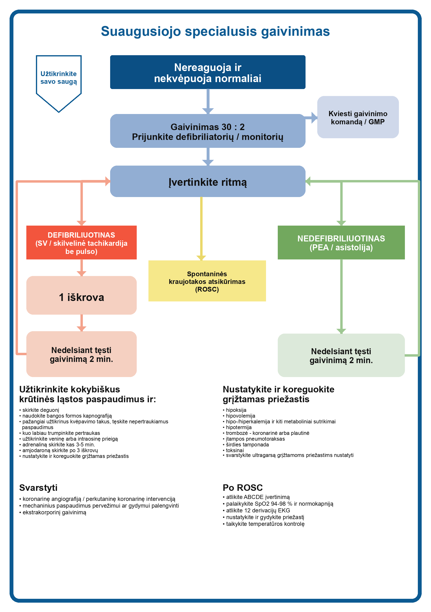

# 1 skyrius. Kardiorespiracinis sustojimas ligoninėje

- Autorė originale: Ann Thompson
- Puslapiai: 22–27
- Tipas: lokalizuotas studijų konspektas pagal originalų PDF, Lietuvos šaltinius ir ERC 2025

> [!NOTE]
> Originalus skyrius remiasi 2021 m. RCUK gairėmis. Ši lietuviška versija papildomai sulyginta su galiojančiu Lietuvos gaivinimo standartu, Lietuvos teisės aktais ir naujausiomis ERC 2025 gairėmis.

<!-- page:22 -->

Šiame skyriuje aptariamas širdies sustojimo ligoninėje atpažinimas, pradiniai veiksmai, ritmo analizė, specialusis gaivinimas ir priežiūra po spontaninės kraujotakos atsikūrimo. Visi stacionaro darbuotojai turi mokėti atpažinti širdies sustojimą, nedelsdami pradėti gaivinimą ir laiku iškviesti papildomą pagalbą.

Kai yra pagrindo manyti, kad gaivinimas būtų netikslingas ar beviltiškas, šį klausimą reikia aptarti iš anksto, o ne kritinės situacijos metu.

## Pagrindinė informacija

Širdies sustojimas ligoninėje pasitaiko maždaug 1–1,5 atvejo 1000 hospitalizacijų per metus. Dažniausias pradinis ritmas yra nedefibriliuotinas: elektrinė veikla be pulso (PEA) sudaro apie 52 %, asistolija apie 21 %. Defibriliuotinas ritmas, t. y. skilvelių virpėjimas arba skilvelinė tachikardija be pulso, nustatomas maždaug 17 % atvejų.

Dauguma šių įvykių įvyksta vidaus ligų skyriuose gydomiems pacientams. Blogėjimo požymiai iki širdies sustojimo pastebimi maždaug 50–80 % pacientų, todėl ankstyvas būklės blogėjimo atpažinimas ir skubus pagalbos iškvietimas yra itin svarbi širdies sustojimo prevencijos priemonė.

> [!IMPORTANT]
> Ligoninėje širdies sustojimo prevencija prasideda anksčiau nei pats gaivinimas: reikia atpažinti blogėjančią būklę, nedelsti kviesti papildomą pagalbą ir aktyvuoti reagavimo komandą.

## Pradiniai veiksmai

Suaugusiojo specialusis gaivinimas prasideda nuo greito, struktūruoto įvertinimo:

1. Užtikrinkite savo ir aplinkinių saugą.
2. Įvertinkite paciento reakciją.
3. Šaukitės pagalbos.
4. Atverkite kvėpavimo takus galvos atlošimo ir smakro pakėlimo manevru.
5. Ne ilgiau kaip 10 s vertinkite kvėpavimą ir kitus gyvybės požymius.
6. Jei tikrinate centrinį pulsą, tai darykite tik kartu su kvėpavimo vertinimu.
7. Patvirtinus širdies sustojimą, nedelsdami pradėkite gaivinimą ir pasirūpinkite defibriliatoriumi ar monitoriumi.

> [!IMPORTANT]
> Agoninis kvėpavimas turi būti laikomas širdies sustojimo požymiu, o ne „dar esančiu kvėpavimu“.

> [!WARNING]
> Lietuvos kontekstas: originale nurodytas vidinis numeris `2222` atspindi JK ligoninių praktiką. Lietuvoje naudokite savo įstaigos vidaus kritinės pagalbos arba gaivinimo komandos iškvietimo tvarką. Kai kuriose Lietuvos ligoninėse, pvz. Santaros klinikose, nuo 2025 m. taip pat taikomas `2222`, bet tai nėra universalus nacionalinis standartas visoms įstaigoms.

<!-- page:23 -->

## 1.1 paveikslas. Suaugusiojo specialusis gaivinimas

Mokymuisi papildomai naudokite šią tekstinę algoritmo santrauką:

1. Jei pacientas nereaguoja ir nekvėpuoja normaliai, kvieskite pagalbą ir pradėkite gaivinimą.
2. Atlikite gaivinimą santykiu `30 : 2` ir prijunkite defibriliatorių ar monitorių.
3. Įvertinkite ritmą.
4. Jei ritmas defibriliuotinas, atlikite vieną iškrovą ir iš karto tęskite gaivinimą 2 min.
5. Jei ritmas nedefibriliuotinas, iš karto tęskite gaivinimą 2 min. ir kuo anksčiau skirkite adrenalino.
6. Po kiekvieno 2 min. ciklo iš naujo įvertinkite ritmą.
7. Po trečios iškrovos skirkite 1 mg adrenalino ir 300 mg amjodarono į veną arba į kaulą.
8. Adrenaliną kartokite kas 3–5 min., o po penktos iškrovos galima svarstyti dar 150 mg amjodarono.
9. Viso gaivinimo metu užtikrinkite kokybiškus krūtinės ląstos paspaudimus, skirkite deguonį, naudokite kapnografiją, užtikrinkite kraujagyslinę arba intraosinę prieigą ir ieškokite grįžtamų priežasčių.
10. Po spontaninės kraujotakos atsikūrimo tęskite ABCDE vertinimą, priežasties korekciją ir pogaiviniminę priežiūrą.

## Krūtinės ląstos paspaudimai

Krūtinės ląstos paspaudimus pradėkite iš karto, kai tik patvirtinamas širdies sustojimas.

- Rankas dėkite į krūtinkaulio apatinės pusės vidurį.
- Paspaudimų dažnis turi būti `100–120/min.`.
- Gylis turi būti `5–6 cm`.
- Po kiekvieno paspaudimo leiskite krūtinės ląstai pilnai atsistatyti.
- Po 30 paspaudimų padarykite trumpą pauzę 2 įpūtimams, jei komanda pasirengusi ventiliuoti.
- Bet kuri pauzė paspaudimuose turi būti trumpesnė nei 5 s.
- Paspaudimus atliekantys darbuotojai turėtų keistis bent kas 2 min.
- Jei yra galimybė, naudokite grįžtamojo ryšio priemones paspaudimų kokybei vertinti.
- Esant indikacijoms ir turint priemonę, galima naudoti mechaninį krūtinės ląstos paspaudimų prietaisą.

## Kvėpavimo takai ir ventiliacija

Kvėpavimo takams atverti naudokite galvos atlošimo ir smakro pakėlimo arba žandikaulio pakėlimo manevrą. Jei reikia, išsiurbkite sekreciją iš burnos ertmės.

Ventiliacijai naudokite maišą su vožtuvu ir kauke, prijungtą prie `15 L/min.` deguonies srauto. Tai dviejų žmonių technika:

- vienas darbuotojas sandariai priglaudžia kaukę ir atveria kvėpavimo takus;
- kitas po kiekvienų 30 paspaudimų atlieka įpūtimus.

Kiekvienas įpūtimas turi trukti apie 1 s ir būti tik tokio tūrio, kad matytųsi krūtinės ląstos pakilimas. Perteklinės ventiliacijos reikia vengti, nes ji didina skrandžio išpūtimo ir barotraumos riziką.

Jei reikia, įstatykite orofaringinį vamzdelį. Gaivinimo metu galima įvesti supraglotinį kvėpavimo takų prietaisą, pvz. `i-gel`, jei personalas moka tai atlikti.

Endotrachėjinę intubaciją turėtų atlikti tik patyręs specialistas. Įtvirtinus supraglotinį prietaisą ar endotrachėjinį vamzdelį, krūtinės ląstos paspaudimai ir ventiliacija gali būti asinchroniniai: paspaudimai tęsiami `100–120/min.`, ventiliacija atliekama `10–12/min.` dažniu.

Viso gaivinimo metu, kai tik tai įmanoma, prijunkite bangos formos kapnografiją.

<!-- page:24 -->

## Širdies sustojimo ritmo valdymas

Vos pradėjus krūtinės ląstos paspaudimus, kuo greičiau prijunkite defibriliatorių ir įvertinkite ritmą.

Defibriliatoriaus elektrodus klijuokite ant sausos odos, gerai prispausdami:

- vieną elektrodą dėkite dešinėje krūtinkaulio pusėje, žemiau raktikaulio;
- kitą elektrodą dėkite kairėje vidurinėje pažasties linijoje, vengdami krūties audinio.

Įjungę defibriliatorių, ritmą tikrinkite kuo trumpiau, tik tiek, kiek reikia nuspręsti dėl tolesnių veiksmų. Ritmai skirstomi į:

- defibriliuotiną: skilvelių virpėjimas arba skilvelinė tachikardija be pulso;
- nedefibriliuotiną: elektrinė veikla be pulso arba asistolija.

## Defibriliuotinas ritmas

Jei ritmas defibriliuotinas ir naudojamas rankinis defibriliatorius:

1. Trumpai sustabdykite paspaudimus tik ritmo patvirtinimui.
2. Komandos vadovas aiškiai įvardija ritmą.
3. Kol defibriliatorius kraunamas, paspaudimai tęsiami, jei tai techniškai saugu.
4. Visi aplink pacientą atsitraukia, laisvai tiekiamas deguonis atitraukiamas nuo krūtinės ląstos zonos.
5. Atlikite iškrovą.
6. Iš karto po iškrovos atnaujinkite gaivinimą ir tęskite 2 min.
7. Po 2 min. ciklo iš naujo įvertinkite ritmą.

Jei po pirmų 2 min. ritmas išlieka defibriliuotinas, kartokite seką. Po trečios iškrovos ir atnaujinus gaivinimą skirkite:

- `adrenalino 1 mg 1 : 10 000` į veną arba į kaulą;
- `amjodarono 300 mg` į veną arba į kaulą.

Adrenaliną kartokite kas `3–5 min.`, t. y. maždaug kas antrą gaivinimo ciklą. Po penktos iškrovos galima svarstyti dar `150 mg` amjodarono.

> [!IMPORTANT]
> Jei ritmas aiškiai defibriliuotinas, pulso prieš iškrovą tikrinti nereikia. Po iškrovos taip pat nedarykite papildomos pauzės pulso ar ritmo tikrinimui.

## Defibriliatoriai ir pulso tikrinimas

Personalas turi mokėti naudotis įstaigoje naudojamais defibriliatoriais. Vieni aparatai gali veikti automatinio išorinio defibriliatoriaus režimu, kiti naudojami kaip rankiniai defibriliatoriai su monitoriumi.

Automatinio išorinio defibriliatoriaus režimu būtina tiksliai vykdyti balso komandas, tačiau saugos patikra prieš iškrovą išlieka tokia pat svarbi kaip ir dirbant rankiniu režimu.

Pulsą tikrinkite tik tada, kai monitoriuje matomas organizuotas ritmas, galintis užtikrinti kraujotaką.

<!-- page:25 -->

## Nedefibriliuotinas ritmas: elektrinė veikla be pulso ir asistolija

Jei prijungus elektrodus patvirtinama elektrinė veikla be pulso arba asistolija:

1. Nedelsdami atnaujinkite krūtinės ląstos paspaudimus.
2. Tęskite gaivinimą 2 min. ciklais.
3. `Adrenalino 1 mg 1 : 10 000` į veną arba į kaulą skirkite kuo anksčiau, vos tik turima prieiga.
4. Adrenaliną kartokite kas `3–5 min.`.
5. Prieš kiekvieną adrenalino dozę patikrinkite ritmą.

Paskyrus pirmą adrenalino dozę, toliau jį kartokite kas antrą gaivinimo ciklą. Šios tvarkos laikykitės ir tada, kai ritmas išlieka nedefibriliuotinas, ir tada, kai vėliau tampa defibriliuotinas.

## Grįžtamos širdies sustojimo priežastys

Kol vyksta gaivinimas, komandos vadovas turi rinkti informaciją apie įvykius iki širdies sustojimo, peržiūrėti ligos istoriją ir kryptingai ieškoti grįžtamų priežasčių. Klasikinė atmintinė yra `4H ir 4T`:

- hipoksija;
- hipovolemija;
- hiperkalemija, hipokalemija ir kiti metaboliniai sutrikimai;
- hipotermija;
- trombozė, koronarinė arba plautinė;
- įtampos pneumotoraksas;
- širdies tamponada;
- toksinai.

Nustačius tikėtiną grįžtamą priežastį, ją pradėkite šalinti nedelsdami ir tuo pat metu tęskite gaivinimą. Jei gaivinimas užsitęsia, pvz. kai skiriama trombolizė dėl plautinės embolijos, mechaninis krūtinės ląstos paspaudimų prietaisas gali padėti išlaikyti kokybiškus paspaudimus.

Ultragarsas gali padėti nustatyti kai kurias grįžtamas priežastis, tačiau jį turi atlikti įgudęs specialistas ir taip, kad ritmo patikros pauzė neviršytų 10 s.

## Po spontaninės kraujotakos atsikūrimo

Po spontaninės kraujotakos atsikūrimo reikia pilno `ABCDE` įvertinimo.

- Palaikykite `SpO2 94–98 %`.
- Užtikrinkite kvėpavimo takus; jei reikia ilgalaikio kvėpavimo takų valdymo, svarstykite endotrachėjinę intubaciją.
- Ventiliaciją koreguokite taip, kad `PaCO2` išliktų normokapnijos ribose: `4,7–6,0 kPa` (`35–45 mmHg`).
- Užtikrinkite patikimą kraujagyslinę prieigą, tęstinį monitoravimą ir atlikite 12 derivacijų EKG.
- Koreguokite skysčius ir kraujotaką taip, kad pacientas išliktų normovolemiškas ir būtų užtikrinta organų perfuzija.
- Praktinis orientyras: `vidutinis arterinis spaudimas >65 mmHg`, o sistolinis arterinis kraujospūdis dažniausiai bent apie `100 mmHg`.
- Aktyviai venkite karščiavimo, ypač komos būklėje esantiems pacientams po ROSC; jei taikoma temperatūros kontrolė, ji derinama su intensyviosios terapijos komanda pagal aktualų protokolą.

Nustačius priežastį, tęskite jos gydymą ir nedelsdami pasitelkite reikiamus specialistus, pvz. kardiologus, chirurgus ar intensyviosios terapijos komandą. Anksti nuspręskite, kur pacientas bus gydomas toliau. Pacientą turėtų pervežti tam pasirengusi komanda, turinti visą būtiną įrangą.

Po įvykio svarbūs du dalykai:

- komandos aptarimas po įvykio;
- aiški ir tiksli dokumentacija medicinos įrašuose.

<!-- page:27 -->

## Gaivinimo trukmė

Gaivinimo trukmė negali būti vienoda visiems pacientams. Sprendžiant, ar tęsti gaivinimą, ar jį nutraukti, reikia įvertinti:

- širdies sustojimo aplinkybes;
- iki jo buvusią paciento būklę ir ligas;
- tikėtiną grįžtamą priežastį;
- realią tikimybę pasiekti ne tik ROSC, bet ir kliniškai prasmingą išgyvenimą.

Komandos vadovas turi aiškiai pasakyti planą komandai ir iš anksto įspėti, jei artėjama prie sprendimo nutraukti gaivinimą. Artimuosius reikia aiškiai informuoti ir, kai tinkama, sudaryti jiems galimybę būti su pacientu.

## Sprendimai dėl kardiopulmoninio gaivinimo

Originale cituojamas JK `NCAA` auditas, kuriame išrašymą iš ligoninės pasiekė `23,9 %` pacientų. Šis rodiklis tinka tik bendram kontekstui, bet jo negalima tiesiogiai laikyti Lietuvos sveikatos sistemos rodikliu.

Lietuvoje sprendžiant, ar gaivinimą pradėti, tęsti ar jo netaikyti, reikia vadovautis Lietuvos teisine ir klinikine tvarka, o ne `ReSPECT` ar `DNACPR` formomis. Pagrindiniai kriterijai yra:

- paciento iš anksto pareikštas rašytinis nesutikimas, kad jis būtų gaivinamas;
- gydytojų konsiliumo sprendimas, kad gaivinimas prilygtų beviltiškam gaivinimui;
- tinkamas šio sprendimo dokumentavimas pagal galiojančią Lietuvos tvarką.

> [!WARNING]
> `ReSPECT` ir `DNACPR` yra JK sistemos dokumentai. Lietuvoje jų negalima perkelti kaip tiesioginio atitikmens. Reikia vadovautis Lietuvos teisės aktais, įstaigos vidaus tvarka ir dokumentuotais konsiliumo sprendimais.

## Tolesnis skaitymas

- [SAM įsakymas Nr. V-822 „Dėl gaivinimo standartų patvirtinimo“](https://e-seimas.lrs.lt/portal/legalAct/lt/TAD/TAIS.405743/asr)
- [Lietuvos Respublikos žmogaus mirties nustatymo ir kritinių būklių įstatymas](https://e-seimas.lrs.lt/portal/legalAct/lt/TAD/TAIS.37504/asr)
- [Pradinis ir specialusis suaugusiųjų gaivinimas. Būklės po gaivinimo](https://www.knygynas.vu.lt/pradinis-ir-specialusis-suaugusiuju-gaivinimas-bukles-po-gaivinimo-3)
- [European Resuscitation Council Guidelines 2025 Adult Advanced Life Support](https://www.erc.edu/media/vedoa2ga/gl2025-05-als-e.pdf)
- [ERC/ESICM Guidelines 2025 Post-Resuscitation Care](https://www.erc.edu/media/atqopqm4/gl2025-07-post-resus-e.pdf)
