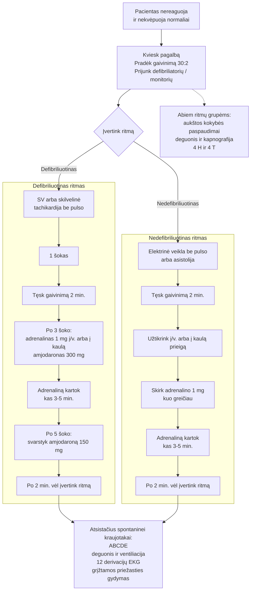

# 1 skyrius. Kardiorespiracinis sustojimas ligoninėje

Mokymosi paskirties vertimas. Klinikinėje praktikoje remkis originaliomis gairėmis ir vietiniais algoritmais.

Autorius: Ann Thompson

## Įvadas

Šiame skyriuje apibendrinamas širdies sustojimo valdymas ligoninėje pagal 2021 m. Jungtinės Karalystės Resuscitation Council UK (RCUK) gaires. Visi ligoninių medicinos darbuotojai turi žinoti, kaip reaguoti į širdies sustojimą, ir reguliariai dalyvauti skubios pagalbos situacijų valdymo mokymuose.

Gaivinimo tikslingumas turi būti įvertintas ir aptartas su pacientu, kad gaivinimas nebūtų atliekamas tais atvejais, kai jis būtų netinkamas ir beprasmis.

## Pagrindinė informacija

Kardiorespiracinio sustojimo ligoninėje dažnis yra apie 1-1,5 atvejo 1000 hospitalizacijų per metus.

Dauguma kardiorespiracinio sustojimo atvejų ligoninėje prasideda nedefibriliuotinu ritmu: elektrine veikla be pulso, tarptautinėje literatūroje dažnai žymima `PEA`, – 52 % ir asistolija – 21 %. Tik 17 % atvejų prasideda defibriliuotinu ritmu, t. y. skilvelių virpėjimu (`SV`) arba skilveline tachikardija be pulso. Dauguma tokių įvykių ligoninėje įvyksta skyriuose (85 %) pacientams, hospitalizuotiems dėl vidaus ligų. Svarbu atsiminti, kad 50-80 % pacientų iki širdies sustojimo pastebimi būklės blogėjimo požymiai, todėl labai svarbu laiku atpažinti blogėjimą ir užkirsti kelią kardiorespiraciniam sustojimui.

> Studijų pastaba: lietuviškuose medicinos šaltiniuose dažniausiai rasi `SV` - skilvelių virpėjimą, o ne `VF`. Pulso neturinčiai skilvelinei tachikardijai paprastai vartojama pilna forma `skilvelinė tachikardija be pulso`, o ne `pVT`. Elektrinei veiklai be pulso tarptautinėje literatūroje dažnas trumpinys `PEA`, o senesnėje lietuviškoje literatūroje gali pasitaikyti terminas `elektromechaninė disociacija (EMD)`.

Daugelis Jungtinės Karalystės nacionalinės sveikatos sistemos (NHS) ligoninių teikia duomenis Nacionaliniam širdies sustojimo auditui (National Cardiac Arrest Audit, NCAA), kuris kas ketvirtį pateikia ataskaitas apie patvirtinto širdies sustojimo atvejų dažnį vyresniems nei 28 parų pacientams, kuriems buvo iškviesta gaivinimo komanda ir taikyti krūtinės ląstos paspaudimai ir (arba) defibriliacija. Šis auditas leidžia palyginti konkrečios ligoninės stebimą širdies sustojimo dažnį su kitomis NCAA dalyvaujančiomis ligoninėmis.

## Pradinis valdymas

1.1 paveiksle pateiktas suaugusiųjų išplėstinio gyvybės palaikymo algoritmas. Ankstyvi krūtinės ląstos paspaudimai ir ankstyva defibriliacija, kai jos reikia, yra esminiai paciento išgyvenimui.

Naudok DRS ABC principą: Danger, Response, Shout for help, Airway, Breathing, Circulation.

> Studijų pastaba: `DRS ABC` yra pirminės reakcijos seka kolapso vietoje. Pirmiausia įvertini saugumą (`Danger`), tada ar pacientas reaguoja (`Response`), kuo anksčiau kvieti pagalbą (`Shout for help`), o po to sistemiškai pereini prie kvėpavimo takų, kvėpavimo ir kraujotakos.

Kvėpavimo takus atverk galvos atlošimo ir smakro pakėlimo manevru. Kardiorespiraciniam sustojimui patvirtinti turi būti skiriama ne daugiau kaip 10 s: žiūrėk, klausyk ir jausk, ar yra normalus kvėpavimas ir kiti gyvybės požymiai. Centrinis pulsas gali būti tikrinamas, bet tik kartu vertinant kvėpavimą.

Atmink, kad agoninis kvėpavimas turi būti laikomas kardiorespiracinio sustojimo požymiu.

> Studijų pastaba: agoninis kvėpavimas dažniausiai būna retas, triukšmingas, gaspingo pobūdžio ir nėra normalus kvėpavimas. Jei abejoji, ar kvėpavimas normalus, gaivinimo algoritme jį laikyk nenormaliu ir nedelsk pradėti kardiopulmoninio gaivinimo.

Patvirtinus kardiorespiracinį sustojimą, būtina skubiai kviesti ligoninės gaivinimo komandą pagal vietinę tvarką ir pasirūpinti, kad gaivinimo įranga kuo greičiau būtų prie paciento. Jei esi vienas, trumpam palik pacientą, kad iškviestum pagalbą ir atsineštum įrangą.

> Studijų pastaba: knygoje aprašomas Jungtinės Karalystės kontekstas, kur ligoninėse dažnai naudojamas vidinis numeris `2222`. Lietuvoje vadovaukis savo įstaigos vidaus tvarka ir vietiniu skubios pagalbos iškvietimo algoritmu.

## 1.1 paveikslas

Suaugusiųjų išplėstinio gyvybės palaikymo algoritmo kompaktiška lietuviška schema mokymuisi:



> Studijų pastaba: mazgai `Po 2 min. vėl įvertink ritmą` reiškia grįžimą prie ritmo vertinimo sprendimo taško. Diagramoje sąmoningai nepaliktos ilgos grįžtamosios rodyklės, kad schema būtų kompaktiškesnė Obsidian aplinkoje.

Paveikslo failai:

- pagrindinis `Obsidian` paveikslėlis: [001-figure-1-1-advanced-life-support.png](/Users/dzukauskas/Projects/Acute%20Medicine/study/figures/001-figure-1-1-advanced-life-support.png)
- redaguojamas šaltinis: [001-figure-1-1-advanced-life-support.drawio.svg](/Users/dzukauskas/Projects/Acute%20Medicine/study/figures/001-figure-1-1-advanced-life-support.drawio.svg)
- ankstesnis loginis šaltinis: [001-figure-1-1-advanced-life-support.d2](/Users/dzukauskas/Projects/Acute%20Medicine/study/figures/001-figure-1-1-advanced-life-support.d2)
- ankstesnis `D2` renderis: [001-figure-1-1-advanced-life-support-d2.svg](/Users/dzukauskas/Projects/Acute%20Medicine/study/figures/001-figure-1-1-advanced-life-support-d2.svg)

Jei tavo skaityklė dėl kokios nors priežasties nerodo `Mermaid`, žemiau palikta ir tekstinė schemos versija:

```text
Pacientas nereaguoja ir nekvėpuoja normaliai
        |
Kviesk pagalbą / gaivinimo komandą
Pradėk kardiopulmoninį gaivinimą 30:2
Prijunk defibriliatorių / monitorių
        |
     Įvertink ritmą
   /                         \
Defibriliuotinas             Nedefibriliuotinas
SV / skilvelinė              elektrinė veikla be pulso /
tachikardija be pulso        asistolija
   |                         |
1 šokas                      Nedelsiant tęsk gaivinimą 2 min.
   |                         Užtikrink į/v. arba į kaulą prieigą
Nedelsiant tęsk              Skirk adrenalino 1 mg kuo greičiau
gaivinimą 2 min.             |
   |                         Kas 3-5 min. kartok adrenaliną
Po 3 šoko:                   |
adrenalinas 1 mg             Po 2 min. vėl įvertink ritmą
į/v. arba į kaulą            |
amjodaronas 300 mg           -------------------------------┐
   |                                                         |
Kas 3-5 min. kartok adrenaliną                               |
Po 5 šoko: svarstyk                                           |
amjodaroną 150 mg                                             |
   |                                                         |
Po 2 min. vėl įvertink ritmą  <------------------------------┘
```

Gaivinimo metu abiem ritmų grupėms:

- užtikrink aukštos kokybės krūtinės ląstos paspaudimus su kuo mažesnėmis pertraukomis;
- skirk deguonies ir, jei įmanoma, naudok bangos formos kapnografiją;
- aktyviai ieškok ir gydyk grįžtamas priežastis (`4 H` ir `4 T`);
- ultragarsą naudok tik tada, jei tai nedidina pertraukų ir operatorius turi įgūdžių.

Atsistačius spontaninei kraujotakai:

- atlik `ABCDE` įvertinimą;
- tęsk ventiliacijos ir deguonies korekciją;
- atlik 12 derivacijų `EKG`;
- tęsk priežasties paiešką ir gydymą.

> Studijų pastaba: čia pateikta lietuviškai perkurta mokymosi schema pagal originalų RCUK algoritmą. Klinikinėje praktikoje vadovaukis vietiniu algoritmu ir originaliomis gairėmis.

Šaltinis: Resuscitation Council (UK), suaugusiųjų išplėstinio gyvybės palaikymo algoritmas.

## Krūtinės ląstos paspaudimai

Krūtinės ląstos paspaudimai turi būti pradėti vos patvirtinus kardiorespiracinį sustojimą.

Rankos dedamos į apatinės krūtinkaulio pusės vidurį, t. y. į krūtinės ląstos centrą.

Paspaudimai turi būti atliekami 100-120 kartų per minutę dažniu, 5-6 cm gyliu. Po kiekvieno paspaudimo krūtinės ląstai turi būti leidžiama visiškai sugrįžti į pradinę padėtį.

Atlikus 30 paspaudimų, padaroma pauzė 2 įpūtimams, jei kolegos jau pasirengę naudoti maišą su vožtuvu ir kauke.

Bet kokia paspaudimų pauzė turi trukti trumpiau nei 5 s.

Asmenys, atliekantys paspaudimus, turi keistis bent kas 2 min., kad būtų išlaikyta aukšta paspaudimų kokybė. Jei yra galimybė, turėtų būti naudojama kardiopulmoninio gaivinimo grįžtamojo ryšio priemonė, leidžianti stebėti paspaudimų kokybę. Visos pauzės turi būti suplanuotos ir ne ilgesnės kaip 5 s.

Jei yra galimybė, reikia pasitelkti mechaninį krūtinės ląstos paspaudimų įrenginį.

## Kvėpavimo takai ir ventiliacija

Daugiau informacijos pateikta 105 skyriuje.

Kvėpavimo takus atverk galvos atlošimo ir smakro pakėlimo arba apatinio žandikaulio išstūmimo manevru. Jei reikia, siurbliu pašalink sekretą iš burnos.

Turi būti paruoštas maišas su vožtuvu ir kauke, o vamzdelis prijungtas prie 15 l/min deguonies srauto. Tai dviejų žmonių technika. Vienas asmuo prispaudžia kaukę prie paciento veido, suformuoja sandarų kontaktą tarp kaukės ir veido, o pirštais palei apatinį žandikaulį kelia veidą į kaukę, kartu atverdamas kvėpavimo takus.

Antrasis pagalbininkas po kiekvienų 30 paspaudimų suspaudžia maišą ir atlieka įpūtimus. Kiekvienas įpūtimas turi trukti apie 1 s, o maišas spaudžiamas tiek, kad būtų matomas krūtinės ląstos pakilimas. Reikia vengti per didelės ventiliacijos, kad nesukeltum skrandžio prisipūtimo ar barotraumos.

Jei reikia, įstatomas orofaringinis vamzdelis kvėpavimo takams palaikyti.

Prasidėjus gaivinimui, komanda turi apsvarstyti supraglotinio kvėpavimo takų prietaiso, pvz., i-gel, įvedimą, jei turi atitinkamų įgūdžių.

Endotrachėjinę intubaciją turi atlikti tik kvėpavimo takų valdymo patirties turintys specialistai. Sprendimą intubuoti kvėpavimo takų specialistas priima kartu su komandos vadovu.

Užtikrinus kvėpavimo takus supraglotiniu prietaisu arba endotrachėjiniu vamzdeliu, paspaudimai ir ventiliacija gali būti atliekami asinchroniškai: paspaudimai tęsiami 100-120 kartų per minutę dažniu, o ventiliacija atliekama 10-12 kartų per minutę.

Prie supraglotinio kvėpavimo takų prietaiso, pvz., i-gel, arba endotrachėjinio vamzdelio turi būti prijungta bangos formos kapnografija, kad gaivinimo metu būtų galima stebėti ventiliaciją.

> Studijų pastaba: bangos formos kapnografija rodo iškvepiamo `CO2` kreivę. Ji padeda patvirtinti, kad vamzdelis tikrai yra kvėpavimo takuose, leidžia spręsti apie krūtinės ląstos paspaudimų kokybę, o staigus `EtCO2` padidėjimas gali būti ankstyvas spontaninės kraujotakos atsikūrimo požymis.

## Širdies sustojimo ritmų valdymas

Pradėjus krūtinės ląstos paspaudimus, prioritetas yra kuo greičiau prijungti defibriliatorių, kad būtų galima išanalizuoti ir gydyti širdies sustojimo ritmą.

Defibriliatoriaus elektrodai turi būti klijuojami ant sausos odos. Be tinkamos padėties, svarbu užtikrinti gerą kontaktą su oda: trumpam sustok, kad elektrodai būtų lygiai priklijuoti ir gerai priglustų. Vieną elektrodą dėk dešinėje krūtinkaulio pusėje po raktikauliu. Antrą elektrodą dėk vidurinėje pažasties linijoje, vengiant krūties audinio. Vadovaukis paveikslėliais, esančiais ant elektrodų pakuotės.

Defibriliatorių reikia įjungti, o nustačius ritmą krūtinės ląstos paspaudimai trumpam sustabdomi ritmo analizei.

Ritmas vertinamas kaip defibriliuotinas – `SV` arba skilvelinė tachikardija be pulso – arba nedefibriliuotinas – elektrinė veikla be pulso arba asistolija. Elektrinė veikla be pulso yra dažniausias pradinis širdies sustojimo ritmas ligoninėje.

> Studijų pastaba: šis skirstymas svarbus todėl, kad nuo jo priklauso pirmas veiksmas. `SV` ir skilvelinė tachikardija be pulso gydomi defibriliacija, o elektrinė veikla be pulso ir asistolija pirmiausia reikalauja kokybiško kardiopulmoninio gaivinimo, adrenalino ir grįžtamos priežasties paieškos. Elektrinė veikla be pulso reiškia, kad EKG matoma elektrinė veikla, bet nėra efektyvaus pulso.

## Skilvelių virpėjimas / skilvelinė tachikardija be pulso

Prijungus defibriliatorių, trumpam stabdomi krūtinės ląstos paspaudimai, kad būtų patvirtintas ritmas, o komandos vadovas turi aiškiai įvardyti ritmą komandai.

Jei ritmas yra defibriliuotinas ir naudojamas rankinis defibriliatorius, laikykis tokios sekos:

- Krūtinės ląstos paspaudimai nedelsiant atnaujinami.
- Komandos vadovas perduoda defibriliatoriaus operatoriui kontrolę dėl saugaus šoko atlikimo.
- Defibriliatoriaus operatorius ir paspaudimus atliekantis žmogus turi matyti vienas kitą.
- Defibriliatoriaus operatorius nurodo tęsti paspaudimus ir visiems kitiems atsitraukti, užtikrindamas, kad deguonis būtų pašalintas, jei jis laisvai teka per maišą su vožtuvu ir kauke.
- Paspaudžiamas krovimo mygtukas. Nuo to momento iki paspaudimų sustabdymo ir visų atsitraukimo operatorius neturi liesti defibriliatoriaus.
- Įkrovus defibriliatorių, duodama komanda sustabdyti paspaudimus ir atsitraukti.
- Prieš atliekant šoką dar kartą patikrinama, ar niekas neliečia paciento.
- Atlikus šoką, paspaudimai nedelsiant atnaujinami.

Kardiopulmoninis gaivinimas tęsiamas 2 min., o komandos vadovas turi paruošti komandą kitai suplanuotai pauzei paspaudimuose.

Po 2 min. ritmas analizuojamas pakartotinai. Jei jis vis dar defibriliuotinas, taikomas kitas šokas pagal tą pačią seką. Atlikus šoką, kardiopulmoninis gaivinimas tęsiamas dar 2 min.

Pasibaigus kitoms 2 min., ritmas vėl analizuojamas. Jei jis ir toliau defibriliuotinas, atliekamas dar vienas šokas. Atlikus trečią šoką ir atnaujinus kardiopulmoninį gaivinimą, turi būti skiriama `1 mg` adrenalino `1 : 10 000` į veną (`į/v.`) arba į kaulą ir `300 mg` amjodarono į veną (`į/v.`) arba į kaulą.

Adrenalinas kartojamas kas 3-5 min., t. y. kas antrą gaivinimo ciklą, o po penkto šoko galima svarstyti papildomą 150 mg amjodarono dozę.

## Defibriliatoriai ir pulso tikrinimas

Darbuotojai turi būti susipažinę su ligoninėje naudojamais defibriliatoriais, kad galėtų juos naudoti saugiai ir veiksmingai. Defibriliatoriai gali veikti automatinio išorinio defibriliatoriaus (`AID`) režimu, o kai kur naudojamas ir atskiras `AID`. Skubios pagalbos komanda ir jos vadovas turi laikytis `AID` nurodymų. Šokas bus atliktas tik paspaudus šoko mygtuką, todėl prieš tai būtina atlikti saugos patikrą. Būtina iš anksto patvirtinti kardiorespiracinį sustojimą, kaip aprašyta anksčiau.

`SV` yra nesuderinamas su pulsu, todėl prieš atliekant šoką pulso tikrinti nereikia. Pulsas tikrinamas tik tada, kai ritmas yra suderinamas su gyvybe. Po šoko atlikimo negalima daryti pauzės pulso ar ritmo tikrinimui.

## Elektrinė veikla be pulso / asistolija

Prijungus defibriliatoriaus elektrodus ir įjungus prietaisą, trumpam stabdomi krūtinės ląstos paspaudimai. Jei patvirtinama elektrinė veikla be pulso arba asistolija, paspaudimai nedelsiant atnaujinami ir tęsiami 2 min.

`1 mg` adrenalino `1 : 10 000` į veną (`į/v.`) arba į kaulą turi būti skiriama kuo greičiau, vos tik užtikrinama kraujagyslinė prieiga. Adrenalinas kartojamas kas 3-5 min., t. y. kas antrą gaivinimo ciklą. Prieš kiekvieną adrenalino skyrimą visada turi būti atliekamas ritmo patikrinimas.

Pulsas tikrinamas tik tada, kai ritmas yra suderinamas su gyvybe.

Paskyrus pirmąją adrenalino dozę širdies sustojimo metu, ji kartojama kas 3-5 min. nepriklausomai nuo ritmo. Amjodaronas skiriamas po 3 šokų, nesvarbu, ar jie buvo iš eilės, ar atskirti kitais ciklais.

## Grįžtamos širdies sustojimo priežastys

Kol vyksta gaivinimas, komandos vadovas turi surinkti informaciją iš paciento ligos istorijos ir apie įvykius prieš sustojimą, kad nustatytų galimą priežastį. Grįžtamos priežastys dažnai įsimenamos kaip 4 H ir 4 T:

> Studijų pastaba: `4 H` ir `4 T` yra atmintinė grįžtamoms širdies sustojimo priežastims. Šios priežastys svarbios todėl, kad jas atpažinus ir gydant galima realiai pakeisti gaivinimo baigtį.

- Hipoksija
- Hipovolemija
- Hiperkalemija, hipokalemija ir kiti metaboliniai sutrikimai
- Hipotermija
- Trombozė (vainikinių arterijų arba plaučių)
- Įtampos pneumotoraksas
- Širdies tamponada
- Toksinai

Jei nustatoma tikėtina grįžtama priežastis, jos gydymas turi būti pradėtas nedelsiant, tęsiant išplėstinį gyvybės palaikymą. Jei gaivinimas užsitęsia, pavyzdžiui, kai dėl plaučių embolijos skiriama trombolizė, reikia ieškoti mechaninio krūtinės ląstos paspaudimų įrenginio, kad ilgą laiką būtų išlaikyti veiksmingi paspaudimai. Labai svarbu, kad personalas būtų apmokytas šį įrenginį taikyti kuo mažiau trikdant paspaudimus.

Ultragarsas gali padėti nustatyti kai kurias grįžtamas priežastis, pavyzdžiui, širdies tamponadą ar plaučių emboliją. Tačiau šiam tyrimui reikia įgūdžių ir mokymo, kad operatorius gebėtų gauti reikalingus vaizdus ritmo patikrinimo metu ir per 10 s.

## Veiksmai atsistačius spontaninei kraujotakai (angl. `ROSC`)

> Studijų pastaba: `ROSC` reiškia spontaninės kraujotakos atsikūrimą, t. y. po gaivinimo vėl atsiranda efektyvi sava kraujotaka. Nuo šio momento prioritetas keičiasi iš „gaivinti“ į „stabilizuoti pacientą ir rasti priežastį“.

Turi būti atliktas pilnas ABCDE įvertinimas.

Deguonies saturacija turi būti palaikoma 94-98 % ribose. Jei pacientui reikia tolesnio kvėpavimo takų užtikrinimo, reikia svarstyti endotrachėjinę intubaciją, jei ji dar neatlikta. Turi būti tęsiama bangos formos kapnografija, o ventiliacija koreguojama taip, kad būtų palaikoma normokapnija.

Reikia užtikrinti patikimą kraujagyslinę prieigą; prieš perkėlimą gali prireikti papildomų kateterių. Turi būti taikomas nuolatinis monitoravimas ir atlikta 12 derivacijų EKG. Skysčių terapija tęsiama siekiant normovolemijos ir sistolinio arterinio kraujospūdžio >100 mmHg.

Paciento temperatūra turi būti palaikoma 32-36 °C ribose. Reikia atsiminti, kad atsistačius spontaninei kraujotakai pacientai dažnai būna atvėsę, todėl juos reikia užkloti ir prireikus šildyti. Reikia vengti drebulio.

Bet kuri nustatyta grįžtama priežastis turi būti toliau gydoma. Komanda turi kreiptis į atitinkamus specialistus, pavyzdžiui, kardiologus ar chirurgus, kad būtų suteiktas galutinis gydymas. Taip pat turi būti nuspręsta, kur pacientą geriausia toliau gydyti. Jei pacientas perkeliamas, tai turi atlikti kvalifikuota komanda, užtikrinant, kad visa reikalinga įranga būtų paruošta.

Komandai turi būti suteikta galimybė aptarti įvykį po gaivinimo, o pats įvykis turi būti užfiksuotas paciento dokumentacijoje vieno iš gaivinime dalyvavusių komandos narių.

## Gaivinimo trukmė

Kiekvieno gaivinimo trukmė turi būti sprendžiama individualiai, atsižvelgiant į konkretų pacientą. Labai svarbu, kad komandos vadovas gaivinimo metu surinktų pakankamai informacijos, jog sprendimas būtų pagrįstas kardiorespiracinio sustojimo aplinkybėmis, paciento interesais ir tikimybe pasiekti ne tik spontaninės kraujotakos atsikūrimą, bet ir ilgalaikį išgyvenamumą bei gyvenimo kokybę.

Komandos vadovas turi pasidalyti savo vertinimu su komanda ir siekti bendro sutarimo su visais gaivinime dalyvaujančiais nariais. Svarbu, kad visi komandos nariai būtų iš anksto informuoti apie planą nutraukti gaivinimą ir turėtų galimybę, jei reikia, užduoti klausimus.

Visais atvejais asmenys, kurie pacientui yra svarbiausi, turi būti informuoti apie įvykį ir jiems turi būti suteikta galimybė pabūti su pacientu. Turi būti aiškus planas, kas ir kaip kalbės su paciento artimaisiais bei pasitiks juos, jei jie vyksta į ligoninę.

## Sprendimai dėl kardiopulmoninio gaivinimo

NCAA duomenimis, išgyvenamumas iki išrašymo iš ligoninės yra 23,9 %, remiantis duomenimis iš 175 ligoninių Jungtinėje Karalystėje. Pacientai, kuriems ligoninėje įvyksta širdies sustojimas, dažnai turi reikšmingų gretutinių ligų arba gyvybę ribojančią patologiją. Kardiopulmoninis gaivinimas nėra nepavojingas: kai kuriems pacientams jis gali reikšti orumo neatitinkančią mirtį ir gydymą, kuris neveiks.

ReSPECT (Recommended Summary Plan for Emergency Care and Treatment) yra RCUK iniciatyva. ReSPECT suteikia struktūrą bendram sprendimų priėmimui dėl skubios pagalbos priemonių, įskaitant kardiopulmoninį gaivinimą. Šis planas laikui bėgant gali būti keičiamas, bet jis padeda suprasti paciento pageidavimus tais atvejais, kai pats pacientas nebegali dalyvauti priimant sprendimus. Daugelyje Jungtinės Karalystės ligoninių šis modelis keičia anksčiau naudotą DNACPR (Do Not Attempt Cardiopulmonary Resuscitation) procesą.

> Studijų pastaba: `ReSPECT` ir `DNACPR` yra Jungtinės Karalystės sistemos dokumentai. Jų formos ir teisinis reglamentavimas Lietuvoje gali skirtis, bet principas tas pats: iš anksto aptarti, kokios skubios pagalbos priemonės pacientui būtų tikslingos, o kokios ne.

## Tolimesnis skaitymas

- National Cardiac Arrest Audit (NCAA). Welcome to the National Cardiac Arrest Audit. https://ncaa.icnarc.org/Home
- Resuscitation Council UK. ReSPECT for healthcare professionals. https://www.resus.org.uk/respect/respect-healthcare-professionals
- Resuscitation Council UK. Resuscitation guidelines 2021. Adult advanced life support guidelines. https://www.resus.org.uk/library/2021-resuscitation-guidelines/adult-advanced-life-support-guidelines
